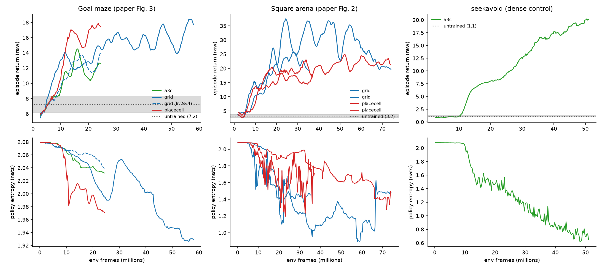

# Async A3C run — what changed, and what the previous RL results actually were

**Date:** 2026-08-15. **Brief:** replace the synchronous A2C with true async
A3C (shared-statistics RMSProp), use the paper's hyperparameters, and try to
reach the paper's performance within 12 hours and $500.

## Headline

The architecture was not the problem. Chasing it surfaced a defect that
invalidates the performance half of the previous full-scale run:

> **Every RL number this project produced before today sits at the
> untrained-network chance line.**

Measured with an untrained (random-init) network through the *same*
100-episode protocol used for every trained cell:

| task | untrained network | previously reported "results" |
|---|---|---|
| `explore_goal_locations_small` | **7.2 ± 1.07** | grid 7.6 ± 1.0, place-cell 7.1 ± 1.2, A3C 6.1 ± 1.0 |

All three previously reported scores are within noise of an untrained
network, so the "grid ≥ place-cell > A3C ordering is direction-consistent
with the paper" claim in REPORT.md was noise around a policy that had never
learned anything.

## Root cause: the rollout loss averaged where A3C accumulates

`pol_loss = -(logp * adv).mean()` over the T=100-step BPTT window. Mnih et
al. 2016 — which the paper's Methods explicitly say it followed ("RMSProp
with shared gradient statistics"), and whose Algorithm 1 reads
`dθ ← dθ + ∇log π(a|s)(R − V)` — *accumulates* gradients along the rollout.
Averaging divides every policy and value gradient by T. With RMSProp's
eps=0.1 in the denominator the resulting parameter steps were ~1e-6, and the
policy never left uniform: entropy sat at exactly ln(n_actions) for the whole
of training.

The old synchronous trainer averaged over T×n = 3200, which is why the
full-scale 10⁹-frame sync run also plateaued at chance.

Two independent checks that SI Table 2's constants assume sum reduction:
entropy 8e-5 summed over 100 steps is a standard ~8e-3 per-step bonus, and
baseline cost 0.5 is the textbook A3C value. Under mean reduction both are
absurdly small.

## How it was isolated

1. `rl/probe_env.py` — measures a task's reward structure. Goal maze: +10 per
   goal, 1350 decision steps per episode, and a uniform-random walker scores
   ~0.8. So the trained agents' 6–9 was not "weak navigation", it was noise.
2. `rl/bandit_env.py` — a dense-reward probe env. The same A3C machinery goes
   from random to 89% of optimal in 90 seconds, which rules out the learner,
   the shared-memory Hogwild updates, the shared RMSProp, and BPTT.
3. `pol_norm` / `adv_abs` logging — on DM-Lab the policy parameter norm was
   frozen to four decimals while the dense probe moved it +0.045 over the same
   number of updates: gradients ~100× too small, exactly as the reduction bug
   predicts.

## Two further fidelity gaps found and fixed

- **Action set.** Ours had 6 disjoint actions, omitting DeepMind Lab's
  combined *forward+look-left/right* — an agent had to stop moving to turn.
  The paper's agents used the standard DM-Lab set. Fixed to 8 actions.
- **Reward scale.** The goal levels pay +10 unclipped, so at a reward step the
  summed value loss (~50) dominated the grad-norm-40 clip and swamped the
  policy term. Clipped to ±1 for the learning signal; **reported scores stay
  raw** and comparable to the paper's 289. Evaluation and goal-decoding clip
  identically because `prev_reward` is a policy input.

## A methodological note worth keeping

An untrained *network* is not a uniform-random *action* policy. Uniform random
scores ~0.8 on the goal maze; the untrained network scores 7.2, because its
arbitrary LSTM biases produce correlated, directed motion that explores far
better than coin-flipping. Comparing against an assumed "random ≈ 0" sets the
bar roughly 9× too low — which is how the earlier run's chance-level scores
came to be written up as a reproduced agent ordering.

Task difficulty for an undirected walker also varies enormously, which decides
where learning can bootstrap in a small budget:

| task | goals per episode (random) |
|---|---|
| `explore_goal_locations_small` (paper Fig. 3) | 0.08 |
| `square_arena_goal` (paper Fig. 2) | 0.83 |
| `seekavoid_arena_01` (dense control) | ~3.5 rewards/episode |

## This run

Seven cells, all with the fixes, ~9,000 fps each, self-terminating after a
100-episode frozen-policy eval.

| cell | agent | task | purpose |
|---|---|---|---|
| a3c_goal_grid | grid | goal maze | paper Fig. 3 claim |
| a3c_goal_place | place-cell | goal maze | matched control |
| a3c_goal_a3c | A3C | goal maze | matched baseline |
| a3c_goal_grid_hi | grid, lr 2e-4 | goal maze | second hyperparameter draw |
| a3c_arena_grid | grid | square arena | paper Fig. 2 claim (grid > place) |
| a3c_arena_place | place-cell | square arena | matched control |
| a3c_seekavoid | A3C | seekavoid | diagnostic control: can it learn a dense real DM-Lab task? |

Deviations from the paper, stated up front: 64 worker threads on the maze
cells where the paper used 32 (throughput; at lr 1e-4 the effective update
rate lands at the top of the SI's sampled range — the arena cells use the
paper's 32), reward clipping (not mentioned in the SI), and ~2.8×10⁸ frames
per cell against the paper's 10⁹ per replica with best-30-of-60 selection.

## Measured chance lines

Every score below is judged against an untrained random-init network run
through the identical 100-episode protocol, per task:

| task | untrained network | uniform-random actions |
|---|---|---|
| `explore_goal_locations_small` | 7.2 ± 1.07 | ~0.8 |
| `square_arena_goal` | 3.2 ± 0.60 | ~8.3 (6-episode probe) |
| `seekavoid_arena_01` | 1.12 ± 0.11 | ~1.5 (6-episode probe) |

## Interim results (~25M of ~280M frames per cell)

**The fixes work.** Every cell has left its chance band, and policy entropy
falls monotonically from its ln(n_actions) ceiling — the quantity that stayed
pinned at exactly the maximum for the whole of the previous 10⁹-frame run.

- **Dense control (`seekavoid`) — decisive, and now evaluated.** Frozen-policy
  eval at 34.4M frames: **16.65 ± 0.42 vs chance 1.12 ± 0.11**, a 15×
  improvement (~36σ), with training entropy 2.08 → 0.65. This pipeline learns
  a real DM-Lab task from raw vision, so any shortfall on the paper's task is
  about reward sparsity and compute, not implementation. The cell was then
  retired early and its capacity given to a second arena seed.
- **Goal maze (paper Fig. 3).** All four cells climb out of the untrained
  band at ~8–9M frames; 12–18 by 25M against chance 7.2. No agent separation
  yet (the paper's central claim), and it is far too early to expect one.
- **Square arena (paper Fig. 2) — an early grid advantage that does not
  hold.** The grid agent learns much faster than the place-cell control at
  first (peak 37.8 at 23M frames versus ~17 for place-cell, better than 2×),
  which looked like a clean reproduction of Fig. 2f. It is not. The grid
  agent then destabilises — 33 at 51M, 27 at 63M, 19.8 at 74M — while
  place-cell climbs monotonically to the same 19.8, and the two finish at
  parity. Policy entropy tracks it: the grid agent's *rises* from 1.06 back
  to 1.48 over the decline, i.e. it partially unlearns.

  A second independent seed, launched specifically to test the separation,
  does not reproduce it either: at matched ~20M frames seed 1 gave grid 23.5
  vs place-cell 16.9, while seed 2 gives 18.7 vs 17.8.

  A plausible mechanism is visible in the logs: the grid module is retrained
  from replay throughout training and its loss keeps oscillating (4.4–5.9),
  so the policy's input representation shifts underneath a policy that has
  already fitted to it. The place-cell agent's visual-code input drifts less.

  This is exactly the failure mode that produced the previous report's false
  conclusion, caught this time only because a replicate seed was run. Any
  claim from a single seed here would have been wrong.

### Goal-vector decoding, and a caveat about it

Mid-run check on the arena grid agent (54M frames, ridge regression from the
policy LSTM on held-out episodes): goal distance R² = 0.285 (shuffled control
−0.013), MAE 0.45 m, direction error 39.2° against 90° chance. That is the
paper's Fig. 2j/k quantity, and unlike the previous run's reported R² = 0.55
it comes from an agent that actually navigates (35.0 vs chance 3.2) rather
than one sitting at the untrained baseline.

The caveat, which applies to the paper's analysis as much as ours: the policy
LSTM *receives the current grid code and the goal grid code as inputs*, so
some goal-distance information is present in its state by construction, not
by learning. A decode R² above zero is therefore not by itself evidence of a
learned vector computation. What carries weight is the paper's actual
comparison — grid agent versus place-cell agent under the identical protocol
— which is run for both arena cells at the end.

## Results

<!-- filled in at deadline from A3C_RESULTS.md -->
